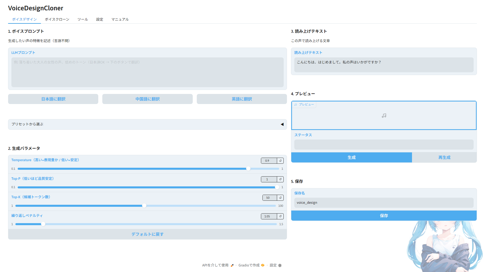

# VoiceDesignCloner

[English README](README.en.md)

**録音不要でオリジナルなAI音声から完全なTTSモデルを作るための教師データ作成ツール。**

音声合成で大変な**録音・コーパス構築・量産・リサンプル**の問題を解決。

[Qwen3-TTS](https://huggingface.co/Qwen/Qwen3-TTS) と [Irodori-TTS](https://github.com/Aratako/Irodori-TTS) の VoiceDesign / VoiceClone / LoRA学習 を GUI で操作できるツールです。
声の設計から [Style-Bert-VITS2](https://github.com/litagin02/Style-Bert-VITS2) の学習用教師データ作成、さらに Irodori-TTS の LoRA ファインチューンまで、一気通貫で完結します。

**UI表示・梱包コーパス・音声生成言語をワンクリックで切り替え — JA / EN / ZH / KO 対応**

---

## 概要

**AITuberやAIキャラ、ゲームボイスやナレーション制作に悩んでいた音声問題をまとめて解決。**

- オリジナルの録音が用意できず、声を作れない
- ゼロショット運用のまま、まともなTTSモデルを動かせていない
- コーパス集めと大量音声生成が大変

声の設計・量産・前処理まで、数回のボタン操作で完結。

**できること：**
- **声の設計** — テキストプロンプトでゼロからオリジナルの声を生成
- **声ガチャ** — 気に入るまで何度でもやり直し可能
- **コーパス一括音声化** — 選んだ声で数百〜数千文をボタン一つで量産
- **LoRAファインチューン**（Irodori-TTS） — クローン出力をそのまま学習データに、シームレスにLoRA学習
- **リサンプル・esd.list生成** — Style-Bert-VITS2学習に必要な前処理まで完結

出力はStyle-Bert-VITS2の学習データ形式（44.1kHz WAV + esd.list）で直接渡せます。
その他音声合成エンジンでも使用できる形で出力できます。

---

## スクリーンショット



---

## 必要環境

| 項目 | 要件 |
|---|---|
| OS | Windows 11 / Linux WSL2（動作確認済み） |
| Python | 3.10〜3.12（推奨: 3.12） |
| GPU | NVIDIA（CUDA対応） |
| VRAM | 8GB〜（推奨: 16GB） |

**動作確認済み環境:**

| OS | GPU | VRAM | RAM |
|---|---|---|---|
| Windows 11 | RTX 4060 Ti | 16GB | 128GB |
| Windows 11 | RTX 3060 | 12GB | 64GB |
| Windows 11 / WSL2 (Ubuntu 22.04) | RTX 5070 | 12GB | — |
| Windows 11 (VRAM 8GB) | — | 8GB | — |

> CPU 単体動作は未確認です。

---

## インストール

```
1. このリポジトリをクローンまたはZIPでダウンロード
2. setup.bat をダブルクリックして実行
3. 完了後、app.bat で起動
```

**Linux の場合は `setup.sh` / `app.sh` を使用してください。WSL2 (Ubuntu 22.04) で動作確認済みです。**

`setup.bat` が venv の作成・PyTorch・依存ライブラリのインストールをすべて自動で行います。

NVIDIA GPU が検出された場合、**faster-qwen3-tts** と **Irodori-TTS** が自動でインストールされます。
Irodori-TTS は torch のバージョンが Qwen3 と非互換（2.10/cu128）なので、専用の venv で別管理しています。

- インストール先: `%USERPROFILE%\.vdc-engines\Irodori-TTS\`（Linux: `~/.vdc-engines/`）
- vdc 本体からはサブプロセスのワーカーとして呼び出されます
- Irodori-TTS の checkpoint / codec は setup 中に Hugging Face から事前ダウンロードされます

PyTorch は GPU に合わせて自動選択されます。RTX 50系では `cu128`、それ以外の NVIDIA GPU では `cu118` を使用します。
自動判定を上書きしたい場合は、環境変数 `VDC_TORCH_CUDA` を指定してください。

Windows:
```
set VDC_TORCH_CUDA=cu128
setup.bat
```

Linux / WSL2:
```
VDC_TORCH_CUDA=cu128 ./setup.sh
```

Irodori-TTS だけを使う場合は、Qwen3-TTS / faster-qwen3-tts のインストールを省略できます（`requirements-irodori.txt` を使用）。

Windows:
```
set VDC_SKIP_QWEN=1
setup.bat
```

Linux / WSL2:
```
VDC_SKIP_QWEN=1 ./setup.sh
```

その他の環境変数:

| 変数 | 既定値 | 内容 |
|---|---|---|
| `VDC_IRODORI_TIMEOUT` | 900 | Irodoriワーカーが無応答（ログ出力なし）の状態がこの秒数続いたら停止 |
| `VDC_IRODORI_IDLE_SECONDS` | 300 | 「数分操作がなければ解放」までの秒数 |

後から faster-qwen3-tts を手動で追加する場合：

```
venv\Scripts\activate
pip install faster-qwen3-tts
```

> **初回起動について**: 初回のみ faster バックエンドが standard にフォールバックすることがあります。2回目以降は正常に faster で動作します。

---

## 使い方

起動後、アプリ内の **Manual タブ** に手順が記載されています。

大まかな流れ：

```
1. [ボイスデザイン]  タブ — 声を設計・プレビュー・保存
2. [ボイスクローン]  タブ — 保存した声でコーパスを一括音声化（オプション: クローン完了後にLoRA学習）
3. [LoRA学習]      タブ — Irodori-TTS の LoRA ファインチューン（独立実行も可能）
4. [Irodori推論]   タブ — 学習済LoRAを1文ずつ試聴・名前付き保存
5. [ツール]         タブ — リサンプル・esd.list 生成
6. [設定]           タブ — 推論バックエンド確認・切替（Qwen3-TTS / faster / Irodori-TTS）
```

基本1と2だけで完結します。LoRA学習/Irodori推論はバックエンドが **Irodori-TTS** のときに本領発揮します。

> **注意**: Voice Clone の停止ボタンを押すと、ステータスが「エラー」と表示されます。これは Gradio の仕様で、実際には正常に停止しています。生成済みのファイルはそのまま残ります。

---

## 対応言語

### UI言語

設定タブから切り替え可能です。

| 言語 | コード |
|---|---|
| 日本語 | JA |
| 英語 | EN |
| 中国語 | ZH |
| 韓国語 | KO |

### 音声生成言語（Qwen3-TTS）

ボイスデザイン・ボイスクローンともに以下の10言語に対応しています。
梱包コーパス（JA/EN/ZH）を使う場合はコーパス言語セレクタで自動連動します。
自前コーパスを持ち込む場合は、上記10言語すべてで生成できます。

| 言語 | 言語 |
|---|---|
| 日本語 (Japanese) | 韓国語 (Korean) |
| 英語 (English) | ドイツ語 (German) |
| 中国語 (Chinese) | フランス語 (French) |
| スペイン語 (Spanish) | イタリア語 (Italian) |
| ポルトガル語 (Portuguese) | ロシア語 (Russian) |

---

## 梱包コーパスについて

| ファイル | 文数 | 内容 |
|---|---|---|
| aica.txt | 500文 | AICAコーパス（AIキャラ用） |
| ita_emotion100.txt | 100文 | ITAコーパス（感情表現） |
| ita_recitation324.txt | 324文 | ITAコーパス（朗読） |
| mana652.txt | 652文 | MANAコーパス |
| rohan4600.txt | 4600文 | ROHANコーパス |

日本語（JA）は原文そのままを収録。英語（EN）・中国語（ZH）は M2M-100 によるオフライン翻訳後、モデルのループ出力・未知語トークン（`<unk>`）をすべて手動で修正済みです。

### AICAコーパスについて

日本語のみAICAコーパスを追加いたしました。
AIキャラ専用に別途作成した500文のコーパスです。
[AICAコーパス](https://github.com/reinehonoka/aica-corpus)

---
## Style-Bert-VITS2 への受け渡し

```
1. output/{フォルダ名}/raw/ の中身を Style-Bert-VITS2 の Data/{モデル名}/raw/ にコピー
2. Tools タブの「esd.list 生成」で esd.list を作成
3. Style-Bert-VITS2 の WebUI で前処理 → 学習を実行
```

esd.list の形式：
```
0001.wav|{話者名}|JP|テキスト内容
0002.wav|{話者名}|JP|テキスト内容
```

> **注意**: 言語列は Tools タブで JP / EN / ZH から選択できます。

---

## 推論バックエンド

| バックエンド | エンジン | 速度 | 対応言語 | 備考 |
|---|---|---|---|---|
| **faster**（推奨） | Qwen3-TTS | 約6-10倍速（RTF ~2.0） | 10言語 | GPU必須・0.6B-Base非対応 |
| **Qwen3-TTS** | Qwen3-TTS | 標準速度 | 10言語 | CPU/GPU両対応 |
| **Irodori-TTS** | Irodori-TTS | 6-7秒/文 | 日本語のみ | GPU必須・48kHz拡散モデル・LoRA対応 |

faster バックエンドは [faster-qwen3-tts](https://github.com/andimarafioti/faster-qwen3-tts) による CUDA Graph 最適化を使用。
**0.6B-Base は faster 非対応**のため、fasterバックエンド選択中でも自動的に standard で動作します。

Irodori-TTS バックエンドを選択すると、ボイスデザイン/ボイスクローン両タブのUIが日本語固定モードに切り替わり、LoRA学習タブとIrodori推論タブが利用可能になります。
バックエンドを切り替えるとアプリが自動再起動し、各タブが対応するUI状態でレンダリングされます。

Irodori-TTS のモデル本体は setup 中に事前ダウンロードされます。生成時はコンソールに `[Irodori] Loading Irodori runtime...` などの進捗ログが表示されます。

Irodori のボイスクローン生成、VoiceDesign、LoRA 推論はすべて
ローカルの Irodori worker と GPU を使用します。

### Irodori-TTS V4

従来の Irodori 画面はそのまま残り、上部の **Irodori V4** タブでV4専用画面へ切り替えられます。

- **統合生成**: CaptionのみのVoice Design、参照音声のみのClone、参照音声＋CaptionのStyle Clone
- **複数参照音声**: 同じ話者の音声を複数指定可能（合計最大120秒、約30秒から効果が大きい）
- **一括クローン**: 日本語コーパス、出力サンプルレート、共通Caption、V4 LoRAに対応
- **V4 LoRA学習**: `output/lora_v4/` と `output/lora_data_v4/` を使用し、既存V3 LoRAと分離
- **軽量モデル**: Full、INT8、INT4、FP8を選択可能。RTX 3060ではFull BF16、INT8、INT4を推奨
- **VRAM解放**: 生成ごとの一時CUDAキャッシュを自動整理。「生成後のGPUメモリ」で「数分操作がなければ解放（既定）」「生成ごとにすぐ解放」「解放しない」を選択。解放時はモデルとGPUワーカーを終了し、CUDAコンテキストまで解放。手動解放ボタンも利用可能
- **seedと設定の保存**: 生成に使ったseedを表示し「seedを固定」で再現可能。Voice Designへ保存すると `{名前}.json` にseed・Caption・モデル・CFGを保存し、ボイスデザインタブから読み込めます
- **長文の自動分割**: 1回の生成上限（約30秒）を超えそうなテキストは文の区切りで分割して生成・連結（参照なしVoice Designでは1チャンク目を以降の参照にして声のブレを防止）
- **一括クローンの再開・再試行**: `Neutral.txt` と `batch_manifest.json` を1行ごとに保存。失敗行は2回再試行後にスキップして続行、再実行すると続きから再開。各行の使用seedも記録
- **品質チェック**: 一括クローン後に信号チェック（途中切れ・無音・音割れ・話速の外れ値）を自動実行。任意でWhisperによる原文照合（CER）も可能。NG行は学習リストから除外、または「NGの行だけ再生成」で作り直し（ツールタブからも利用可）
- **LoRAチェックポイント比較**: 学習中に等間隔でチェックポイントを保存し、同じ文・同じseedで聴き比べて「採用」したstepをそのLoRAの既定に設定。小規模データでは信頼できない検証lossを使わず全データで学習
- **LoRA学習の再開**: 中断した学習を最新チェックポイントから再開（データ変換はスキップ）。新規学習時は前回の結果を `_archive/` に退避
- **Geminiボイスデザイン → Irodori複製**: Gemini TTS（`gemini-3.8-flash-tts`）で声を説明文から設計し、その声で数文を読み上げた約30秒のリファレンスを `output/voice_design/` に保存。統合生成・一括クローンの「保存済みVoice Design」からIrodori V4でローカル複製できます（要 `GEMINI_API_KEY`、Gemini出力は24kHz）。Gemini API追加利用規約は競合モデルの開発への使用を禁止しているため、Gemini由来音声を学習データに使う場合は規約を確認してください
- **GPUジョブの順番待ち**: 生成・学習・品質チェックが重なった場合はエラーにせず、前のジョブの終了を待って実行
- **Irodori時の翻訳モデル**: 任意のM2M100翻訳モデルはGPUへ事前常駐させず、翻訳ボタンを使った場合だけCPUで読み込み

V3用LoRAとV4用LoRAには互換性がありません。既存タブはV2/V3モデルと
`output/lora/`、V4専用タブはV4モデルと`output/lora_v4/`のみを使用します。
量子化V4モデルにLoRAを適用する場合も、LoRA学習自体はFull V4モデルを基盤に行います。

V4のFullモデルとtokenizerはsetup時に事前取得されます。量子化モデルは選択時に必要な
バリアントだけを取得します。既存のIrodoriエンジンがある場合、setupはローカル変更を壊さない
`git pull --ff-only`で更新を試みます。

---

## ライセンス

本ツール: [MIT License](LICENSE)

使用しているOSS:
- [Qwen3-TTS](https://huggingface.co/Qwen/Qwen3-TTS) — Apache License 2.0
- [faster-qwen3-tts](https://github.com/andimarafioti/faster-qwen3-tts) — Apache License 2.0
- [Irodori-TTS](https://github.com/Aratako/Irodori-TTS) — MIT License（モデルカードに追加の倫理制限あり）
- [Semantic-DACVAE-Japanese-32dim](https://huggingface.co/Aratako/Semantic-DACVAE-Japanese-32dim) — MIT License
- [M2M-100](https://huggingface.co/facebook/m2m100_418M) — MIT License
- [Gradio](https://github.com/gradio-app/gradio) — Apache License 2.0
- ITAコーパス / ROHANコーパス / MANAコーパス — Public Domain

詳細: [THIRD_PARTY_LICENSES.md](THIRD_PARTY_LICENSES.md)

---

## 免責事項

本ツールは Qwen3-TTS（Apache License 2.0）および Irodori-TTS（MIT License）の GUI ラッパーです。

### Qwen3-TTS の学習データについて

Qwen3-TTS の学習データはブラックボックスであり、その内容・権利状況は公開されていません。
商用利用の際は Qwen3-TTS の利用規約を十分に確認してください。

### Irodori-TTS の倫理制限について

Irodori-TTS のモデルカードには MIT License に加えて以下の倫理制限が明記されています:

- 実在の人物・声優・著名人の声を**本人の許諾なく意図的に模倣**することの禁止
- 虚偽情報・ディープフェイク目的の音声生成の禁止
- 開発者は誤用について一切の責任を負わない（利用者責任）

LoRA 学習・推論機能を利用する場合は上記制限も遵守してください。

### パブリシティ権・著作権・関連法令について

実在の人物・タレント・声優の声を商用目的で無断クローン・使用することは、
パブリシティ権・著作権・不正競争防止法等の権利侵害に該当する可能性があります。
個人利用と商用利用では法的リスクが大きく異なります。

### 禁止事項

- 詐欺・なりすまし・誹謗中傷を目的とした利用
- 違法または権利侵害となる音声コンテンツの生成・配布

### その他

- 生成した音声コンテンツについて、開発者は一切の責任を負いません
- 本ソフトウェアは現状のまま提供され、いかなる保証も伴いません

---

## サポート / 連絡先

- バグ報告・機能要望: このリポジトリの GitHub Issues を利用してください
- その他の連絡: [零音ほのかのXアカウント](https://x.com/ReineHonoka)のDMにてお願いいたします。

## Special Thanks

このプロジェクトの開発にご協力いただいた皆様に感謝いたします。

### Testers

- [フルエレ](https://x.com/fluele_alpha?s=20)
- [きんくまん](https://x.com/kinkuman_net?s=20)
- [ヒロナ](https://x.com/hirona98?s=20)

### Contributors
- kinkuman — fix: setup.sh numpy pre-install & pip upgrade
